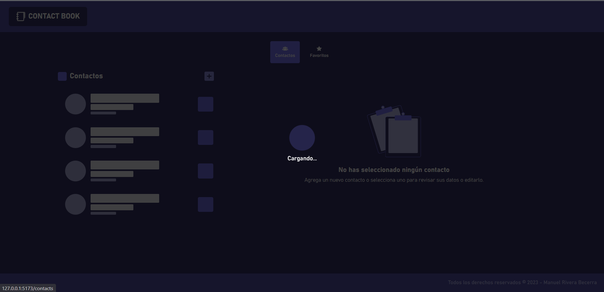
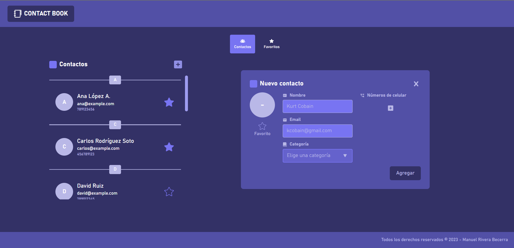
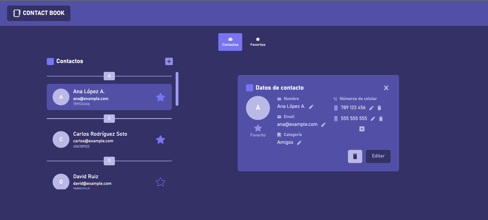
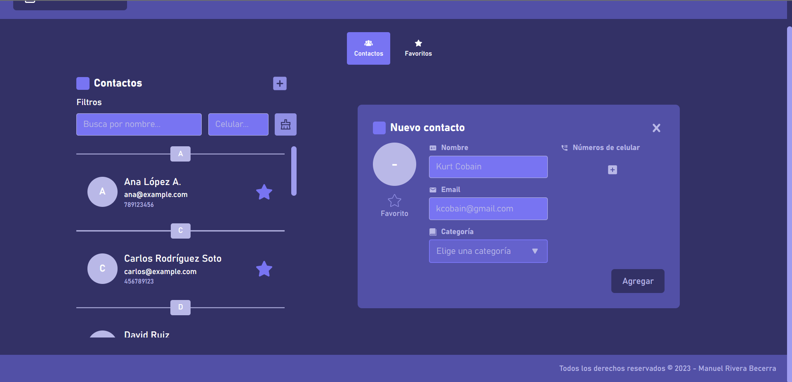
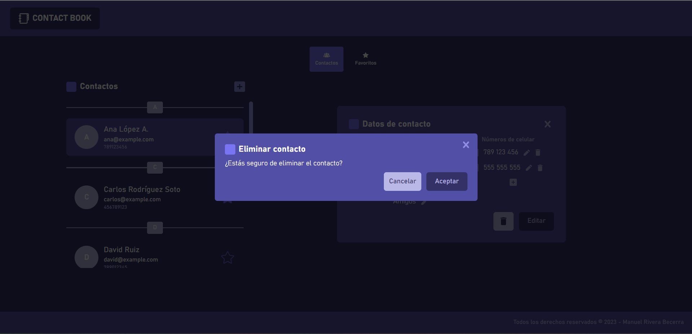
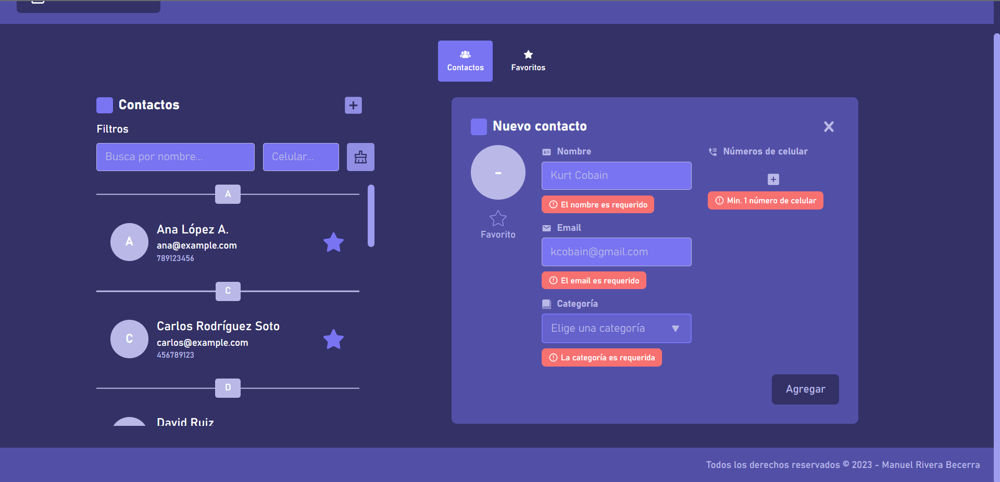
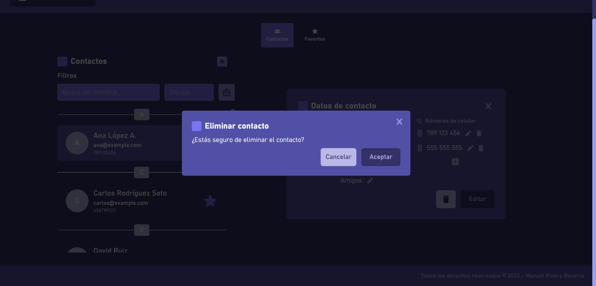
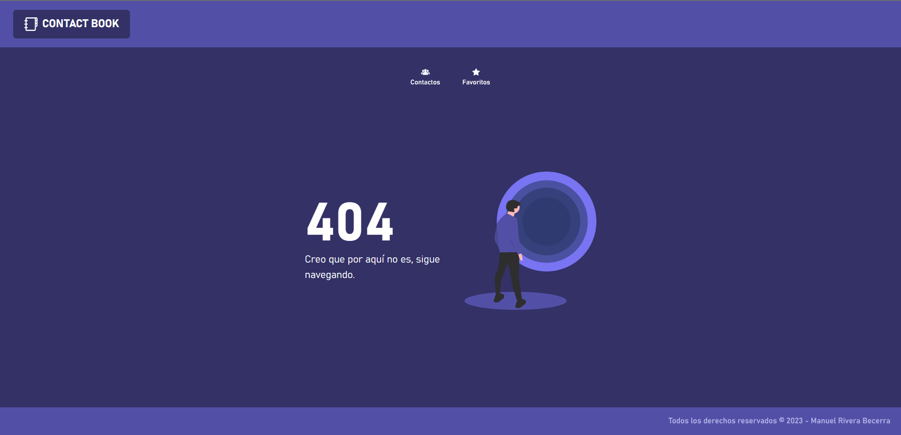

# Contact Book

Aplicación de libreta de contactos.

## Tecnologías

-   _Backend_ con **Java Spring Boot**, JPA y el ORM **Hibernate**.
-   _Frontend_ con **Vue JS 3**, **TailwindCSS**, **vuex**, **typescript**, **vue-toastify** y **vitest** para pruebas unitarias.
-   _Base de datos_ con **MySQL**.

## Herramientas extras

-   **IntelliJ IDEA** como IDE.
-   **VSCode** como editor de código para desarrollar el frontend con Vue.
-   **Postman** para el testing y documentación de los servicios backend.
-   **Asana** para la gestión de las tareas del proyecto.

## Metodología

-   El proyecto aplicó **Scrum** para el desarrollo del proyecto.

## Diseño UX/UI

-   Prototipado en Figma: https://www.figma.com/file/JDXrQJDE1VONRWygN50X4u/Contact-Book-Application

## Product Backlog

| Id  | Requerimiento                            | Descripción                                                                                                                                                                                                              | Estimación |
| --- | ---------------------------------------- | ------------------------------------------------------------------------------------------------------------------------------------------------------------------------------------------------------------------------ | ---------- |
| 1   | Listado de contactos                     | El usuario debe visualizar el listado de sus contactos en orden alfabético según sus nombres y con una previsualización de su nombre de contacto, el número telefónico principal y un ícono con la inicial de su nombre. | 5          |
| 2   | Búsqueda de contactos                    | El usuario debe ser capaz de buscar contactos por nombre de contacto o número telefónico.                                                                                                                                | 8          |
| 3   | Agregado de contactos                    | El usuario debe ser capaz de agregar contactos ingresando su nombre, categoría (familia, amigos, trabajo), email (no obligatorio) y hasta 3 números telefónicos.                                                         | 21         |
| 4   | Edición de contactos                     | El usuario debe ser capaz de editar los datos de cada contacto.                                                                                                                                                          | 21         |
| 5   | Eliminación de contacto                  | El usuario debe ser capaz de eliminar cualquier contacto cuando lo requiera.                                                                                                                                             | 13         |
| 6   | Listado de contactos favoritos           | El usuario debe ser capaz de visualizar su lista de contactos favoritos.                                                                                                                                                 | 8          |
| 7   | Anexo / Desanexo de contacto a favoritos | El usuario debe ser capaz de anexar / desanexar contactos favoritos.                                                                                                                                                     | 8          |
| 8   | Números telefónicos únicos               | El usuario no debe poder registrar números telefónicos que ya existan.                                                                                                                                                   | 8          |

## Capturas de pantalla de la aplicación (Application screenshoots)

-   Cargando contactos (Loading contacts)
    
-   Buscando contactos (Search contacts)
    
-   Sin contactos (No contacts)
    
-   Formulario para agregar contacto (Add contact form)
    
-   Formulario para editar contacto (Edit contact form)
    
-   Validación de formulario (Form validation)
    
-   Confirmación para eliminar contacto (Remove contact confirmation)
    
-   Vista de página no encontrada
    
